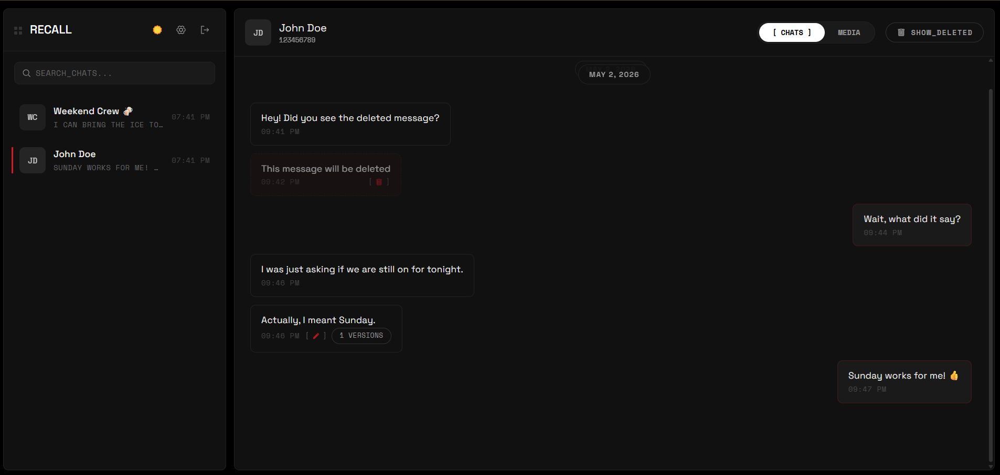
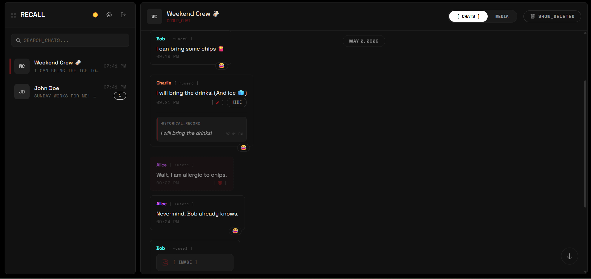
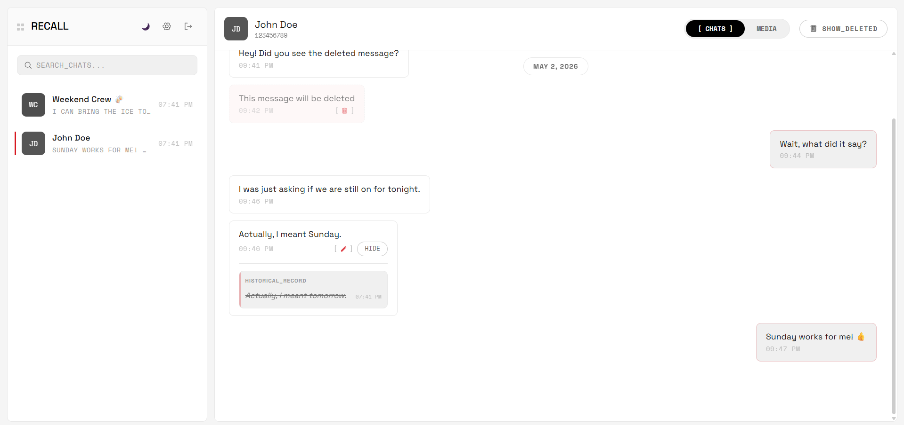
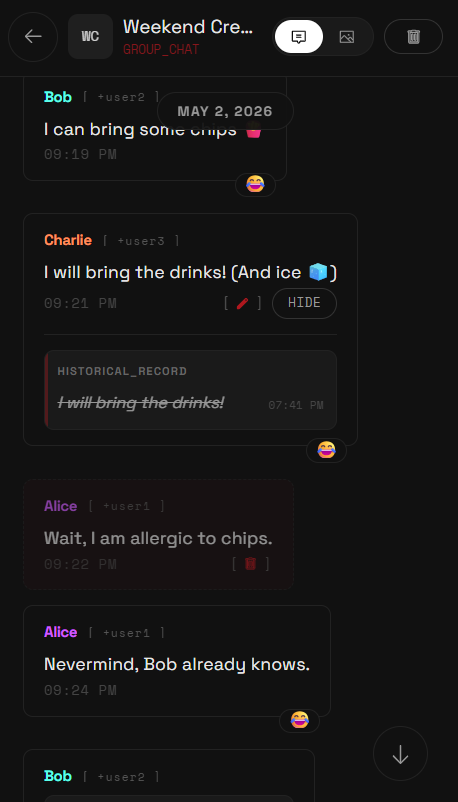
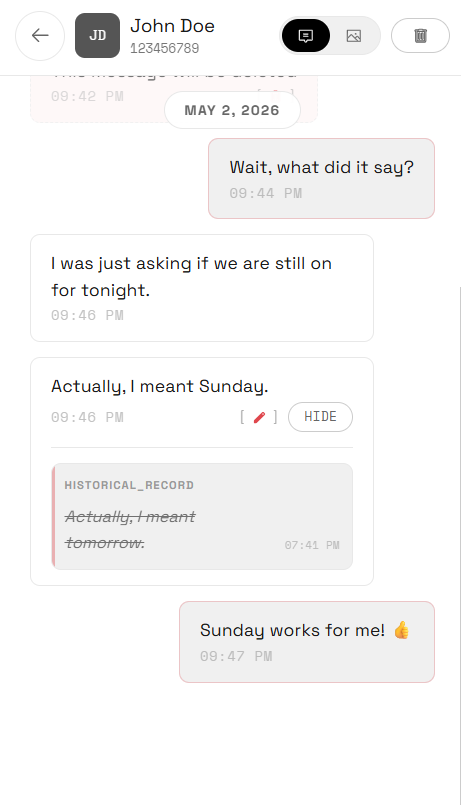

<div align="center">

# WHATSRECALL
### SECURE_MESSAGE_ARCHIVAL_SYSTEM

[](#)
[](https://bun.sh)
[](https://www.solidjs.com/)
[](https://hono.dev/)
[](#design-system)

**NEVER_MISS_A_MESSAGE.**
A privacy-first archival system that captures deleted messages, saves view-once media, and provides a premium technical dashboard for real-time review.

[FEATURES](#01_key_features) • [ARCHITECTURE](#02_technical_architecture) • [QUICK_START](#04_quick_start) • [SECURITY](#06_security__privacy) • [CONTRIBUTE](CONTRIBUTING.md)

---

</div>

## 01_KEY_FEATURES

| MODULE | DESCRIPTION |
| :--- | :--- |
| 🕵️ **SELECTIVE_MONITORING** | Precision control: only track the specific chats you choose. |
| 📸 **VIEW_ONCE_PRESERVATION** | Bypasses "View Once" restrictions by capturing and archiving media. |
| ♻️ **SMART_DEDUPLICATION** | Global SHA-256 media hashing prevents redundant storage and saves disk space. |
| ⚡ **REAL_TIME_SYNC** | Instant dashboard updates via high-performance WebSockets. |
| 🎭 **REACTION_TRACKING** | Full support for real-time message reactions and emoji changes. |
| 🧵 **THREADED_CONTEXT** | Preserves and displays quoted messages to maintain conversation flow. |
| 🔒 **SECURITY_FIRST** | Hardware fingerprinting + `HttpOnly` / `SameSite=Strict` session management. |
| 💎 **NOTHING_AESTHETIC** | Monochromatic dashboard, `Doto` hero type, and functional identification tints. |

---

## 01.5_INTERFACE_PREVIEW

> A premium, high-density dashboard following the Softened Nothing Design System.

### 🖥️ DESKTOP_ARCHIVE
<div align="center">
  
  <br>
  <em>Secure message archival with real-time reaction tracking and edited message history.</em>
</div>

<br>

<div align="center">
  
  
</div>

### 📱 MOBILE_EXPERIENCE
<div align="center">
  
  
</div>


---

## 02_TECHNICAL_ARCHITECTURE

> Built for performance, reliability, and extreme privacy.

| LAYER | TECHNOLOGY | RATIONALE |
| :--- | :--- | :--- |
| **RUNTIME** | [Bun](https://bun.sh) | High-performance JS runtime with native TS support. |
| **BACKEND** | [Hono](https://hono.dev/) | Ultra-fast web framework with standard-compliant fetch API. |
| **FRONTEND** | [SolidJS](https://www.solidjs.com/) | Fine-grained reactivity and minimal UI overhead. |
| **DATABASE** | SQLite (WAL) | Local, file-based persistence with Write-Ahead Logging for concurrency. |
| **WHATSAPP** | [Baileys](https://github.com/WhiskeySockets/Baileys) | Reliable Multi-Device WhatsApp API implementation. |

---

## 03_DESIGN_SYSTEM

This project adheres to the **SOFTENED_NOTHING** design system. It prioritizes information density and typography over decorative elements.

- **TYPOGRAPHY**: `Doto` (Display), `Space Grotesk` (Body), `Space Mono` (Data/Labels).
- **PALETTE**: Strictly achromatic. `#000000` (OLED Background), `#E8E8E8` (Primary Text), `#D71921` (Nothing Red Accent).
- **IDENTIFICATION**: Avatars use grayscale fills; group participants use distinct hues for functional clarity.
- **PHILOSOPHY**: No gradients, no glassmorphism, no unnecessary shadows. High-density information display.

---

## 04_QUICK_START

### 1_INSTALLATION
```bash
# Clone the repository
git clone https://github.com/JKc66/whats_recall.git
cd whats_recall

# Install dependencies and build frontend
bun install
bun run build
```

### 2_CONFIGURATION
```bash
cp .env.example .env
# Edit .env and set a secure AUTH_PASSWORD
# (Optional) Set TRUSTED_PROXIES if running behind a reverse proxy
```

### 3_ENVIRONMENT_VARIABLES

| VARIABLE | DESCRIPTION | DEFAULT |
| :--- | :--- | :--- |
| `AUTH_PASSWORD` | Primary dashboard access password. | `required` |
| `TRUSTED_PROXIES` | Comma-separated IPs of trusted reverse proxies. | `none` |
| `TRUST_PROXY` | Set to `true` to enable proxy header trust. | `false` |
| `DATA_DIR` | Path to persistent storage. | `./data` |
| `MEDIA_DIR` | Path to media archival storage. | `./data/media` |
| `MAX_MEDIA_SIZE` | Override default media download limit (bytes). | `100MB (DB)` |


### 4_EXECUTION
```bash
# Start the production server
bun start
```

*On first run, follow the terminal instructions to pair your account via QR Code or Pairing Code. Dashboard available at `http://localhost:3001/whats/`.*
 
---
 
## 05_PROCESS_MANAGEMENT
 
> For 24/7 reliability, it is recommended to run WhatsRecall using **PM2**.
 
### 1_INSTALL_PM2
```bash
# PM2 requires Node.js/NPM to be installed globally
npm install -g pm2
```
 
### 2_START_DEPLOYMENT
```bash
# Start the project using the pre-configured ecosystem file
pm2 start ecosystem.config.cjs
 
# (Optional) Save the process list to restart on server reboot
pm2 save
```
 
### 3_MONITORING_&_CONTROL
```bash
# View real-time logs
pm2 logs whats-recall

# Clear all log files
pm2 flush whats-recall
 
# Check process status and resource usage
pm2 ls
 
# Restart the service after configuration changes
pm2 restart whats-recall
 
# Stop the service
pm2 stop whats-recall
```
 
---

## 06_PROJECT_STRUCTURE

```text
├── 📂 data/               # Persistent storage (SQLite DB + Media files)
├── 📂 public/             # Optimized frontend production assets
├── 📂 src/                # Backend Architecture (TypeScript)
│   ├── 📂 api/          # Hono routes, middleware & WebSocket server
│   ├── 📂 db/           # Modular SQLite database layer
│   ├── 📂 whatsapp/     # Baileys socket & handlers
│   └── 📂 workers/      # Background media processing
├── 📂 web/                # Frontend (SolidJS + Vite + Tailwind v4)
│   └── 📂 src/          # UI Logic & Components
├── ecosystem.config.cjs    # PM2 Configuration
└── package.json           # Global scripts
```

---

## 07_SECURITY_&_PRIVACY

- **LOCAL_FIRST**: All messages and media are stored exclusively on your hardware.
- **PRIVATE_PAIRING**: WhatsApp QR codes are generated locally. No sensitive pairing data ever leaves your server.
- **SESSION_BINDING**: Access tokens are cryptographically bound to hardware fingerprints via **ThumbmarkJS**. Fingerprinting is mandatory for all sessions.
- **PROXY_HARDENING**: Only trusts `X-Forwarded-For` headers from explicitly configured `TRUSTED_PROXIES`.
- **PAYLOAD_BOUNDARIES**: Automatic rejection of oversized media and JSON payloads to prevent DoS attacks.
- **ZERO_EXTINCTION**: SQLite WAL mode ensures data durability even during unexpected crashes.

---

## 08_DEVELOPMENT

| COMMAND | DESCRIPTION |
| :--- | :--- |
| `bun dev` | Start development server with hot-reloading. |
| `pm2 restart whats-recall` | Restart the production process. |
| `bun fix` | Automatically rewrite arbitrary CSS to match design system. |
| `bun lint` | Project-wide logic and style check. |
| `bun t` | Run tests in quiet diagnostic mode. |
| `bun test` | Full verbose test suite execution. |

---

<div align="center">

---

**[LICENSE_MIT](LICENSE)** • **[CONTRIBUTING](CONTRIBUTING.md)** • **[REPORT_ISSUE](https://github.com/JKc66/whats_recall/issues)**

---
</div>

